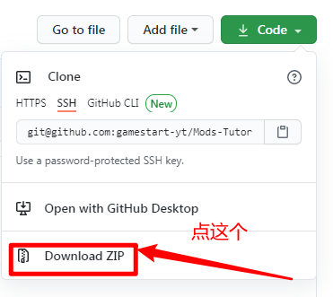
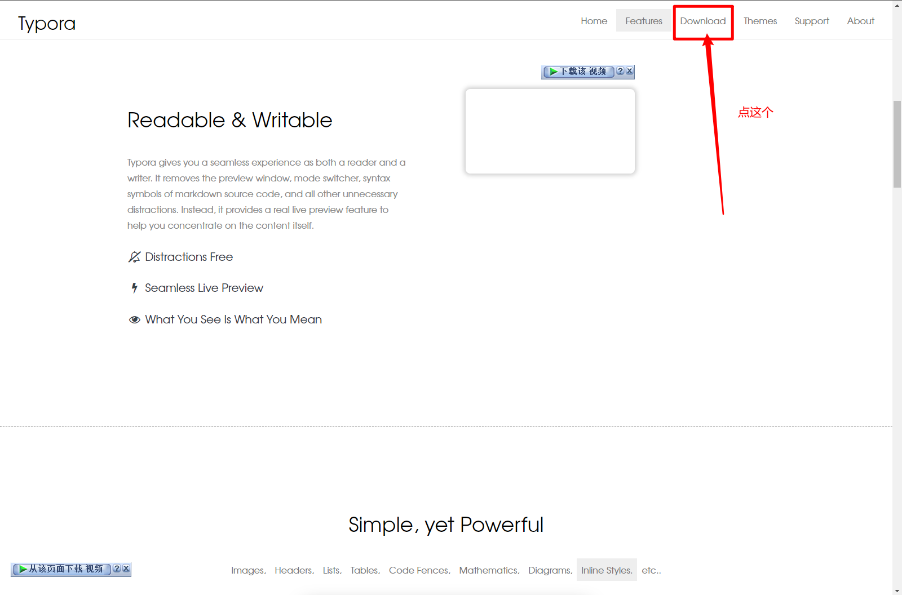
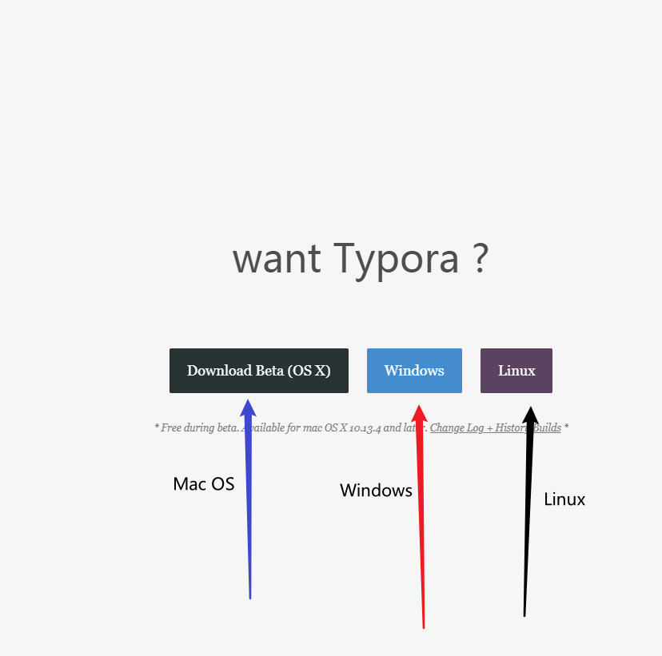

# Foe牌模组教程

## 关于本仓库

这个仓库是我一时兴起制作的，可能有点不全面，感谢[MC百科](https://www.mcmod.cn)提供的参考

**郑重声明：本教程不涉及原版教程或MOD Loader（即Forge、Farbic等）及MOD安装教程，如需原版教程前往[Minecraft Wiki](https://minecraft-zh.gamepedia.com/Minecraft_Wiki)，MOD Loader安装前往[Mod 安装教程 | Forge / liteloader / Fabric 运行环境下载和安装](https://www.mcbbs.net//thread-875660-1-1.html)，如果不说明，本教程所述均为1.12.2版本**

---

## 文档目录

[**Mod-Tutorials**]：文件总目录

|—[**resource**]：README.md的素材文件

|			|—[**image**]：README.md中的图片文件

|—[**Tutorials**]：教程主文件

|			 |—[**[IC2]工业时代2 Industrial Craft 2**]

|						|—[**resource**]：资源文件

|						|		|—[**image**]：图片文件

|						|—[**PDF**]：PDF文件

|						|		|—[**简介.pdf**] 

|						|		|—[**世界生成.pdf**]

|						|—[**简介.md**]

|						|—[**世界生成.md**]

|—[**README.md**]：你所看到的文件

---

## 如何使用

- 用下面的步骤下载仓库（无需下载Typora），打开**PDF**文件夹，使用PDF阅读器打开

- 或配合**Typora**使用，使用教程如下：

----

### 下载该仓库

如图，在仓库界面中找到这三个按钮，然后点击**Code**。点击后会有一个弹出界面，点击**Download ZIP**

下载完成后解压就行了。（什么你不知道解压？快去百度！！）

---

### 下载Typora

1. 进入Typora官网    [点我进入Typora官网](https://typora.io/)

2. 向下滑动后，如图点击**Download**

   

   *P.S.  请无视IDM的下载视频*

3. 接下来根据你的系统进行选择,**Mac OS** / **Windows**/ **Linux**

   

4. 接下来分支

   - **Mac OS**安装
     - 点击后下载一个.dmg文件，双击后安装，一路Next就行了

   - **Windows**安装
     - 点击后进入一个页面，根据电脑位数选择，32位选32位，64位选64位。怎么看电脑位数去百度。打开后一路Next

   - **Linux**安装
     - 点击后进入一个页面，根据其上方所写，打开控制台，输入命令即可

5. 安装完成后在桌面上双击打开即可

---

## 作者的一些话

我家是32位Windows，搞得我Java内存分配最高为1024M，所以我可以安的模组很有限，换系统害怕哪个修电脑的搞个2345到电脑上，这辈子都删不完。

