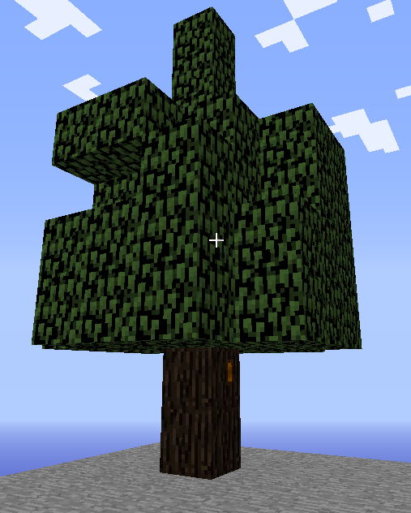
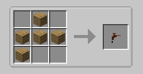
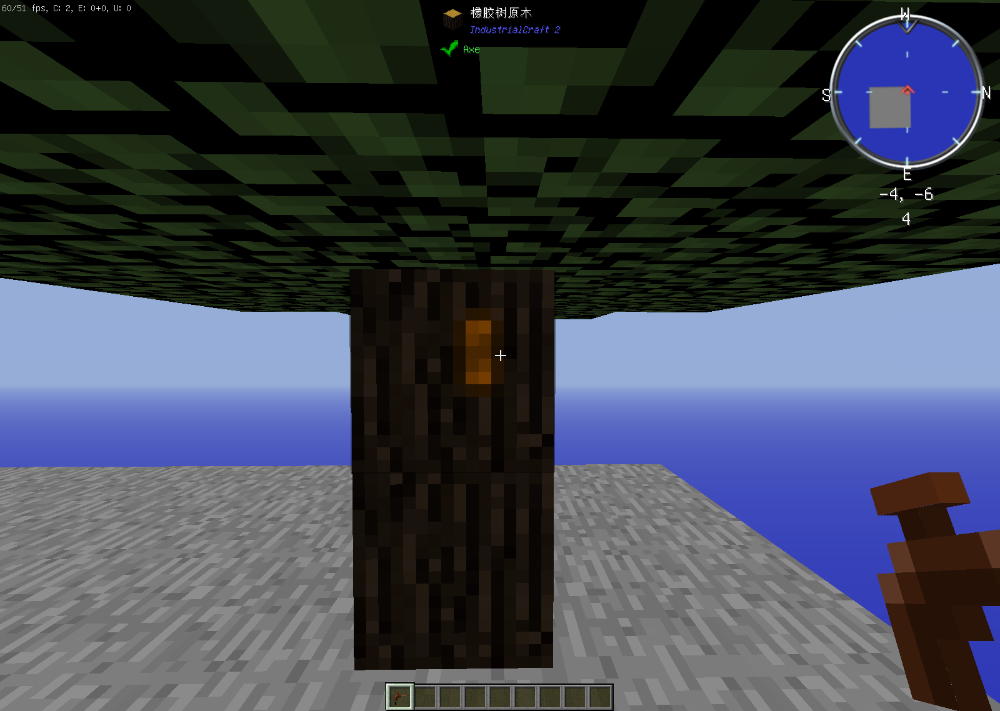
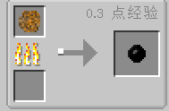
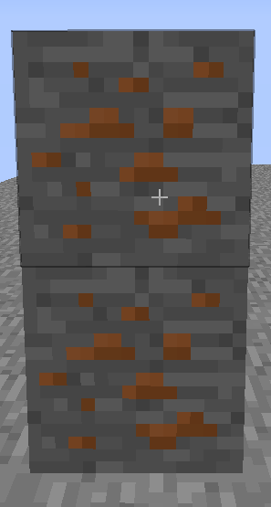
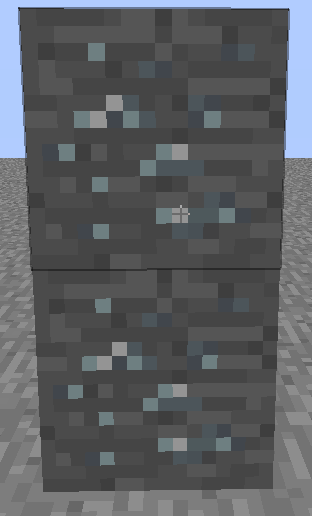
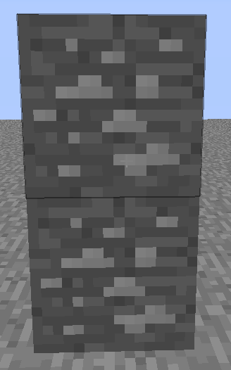
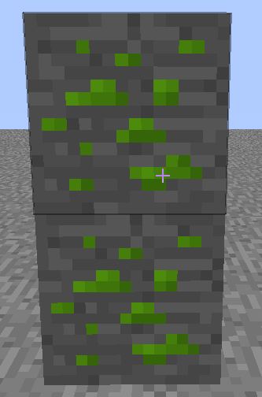

# [IC2]工业时代2 Industrial Craft 2 —— 世界生成

[toc]

## 世界生成

### 树木

* 在工业2中，只会生成一种树木，**橡胶树**，如图。

* 橡胶树在沼泽中生成最多，橡胶树可以砍伐，树叶会腐烂，一定几率掉落**橡胶树树苗**。

* 橡胶树上有一种橙色斑点，如上图，制作**木龙头**可以提取，木龙头合成配方如下图

​		*P.S.  橡木木板可以为任何木板*

---

* 木龙头使用方式

  * 手持木龙头对准黄色斑点并点击鼠标右键，可以获得**粘性树脂**，如图

    

    

* 粘性树脂可以在熔炉中烧制成**橡胶**，橡胶可以制作一系列东西

  

---

### 矿物

在工业2中，有以下几种矿石：**铜矿石、铅矿石、锡矿石、铀矿石**，这几种矿物都可以烧制成为各种锭。

#### 铜矿石

如图为铜矿石

挖掘等级为铁

---

#### 铅矿石

如图为铅矿石

挖掘等级为铁

---

#### 锡矿石

如图为锡矿石

挖掘等级为铁

---

#### 铀矿石

如图为铀矿石

挖掘等级为钻石

---

以上就是所有自然生成，下一篇我们将开始“发电”