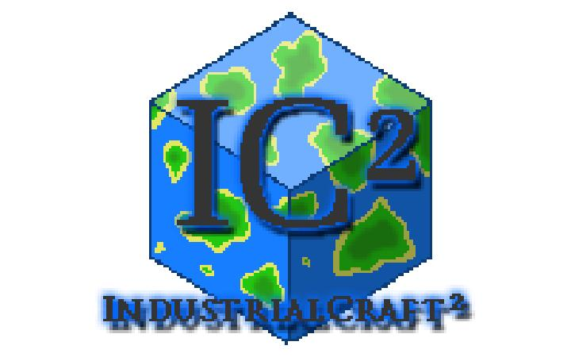

# [IC2]工业时代2 Industrial Craft 2

[toc]

## 简介

> 工业2是围绕Minecraft生活现代化和生产自动化两个主题而展开的Minecraft模组，由IndustrialCraft2 Dev Team开发并维护。
>
> 它在工业1的基础上发展而来，引入了名为Energy Unit（即EU）电力能源系统。
>
> 以及对应的发电设备，并以此为基础添加了大量相关物品、方块以及机器，
>
> 其内容涉及资源处理、矿物采集、农业等多个主题，
>
> 极大地平衡和丰富了前代的游戏体验，
>
> 同时还拥有许多拓展模组，进一步丰富了游戏体验，增加了新的游戏目标。
>
> 
>
> 作为最著名的Minecraft模组之一，
>
> 工业是初次接触大型Minecraft模组的玩家很好的选择。
>
> 
>
> ——MC百科[^1]

工业2是我的世界的一个老牌MOD，在远古版本就有，IC2添加了一系列机器如：电炉、打粉机等…，是我的世界的大型MOD，由于有些硬核，一些新手便摸不着头脑（我刚开始玩就是），IC2下载链接：[点我](https://www.curseforge.com/minecraft/mc-mods/industrial-craft)

**本模组使用的版本是industrialcraft-2-2.8.101-ex112,为了讲解方便，我还安装了    [ExU2] 更多实用设备2 Extra Utilities2**

---

[^1]: MC百科工业时代2对应条目 (https://www.mcmod.cn/class/2.html)